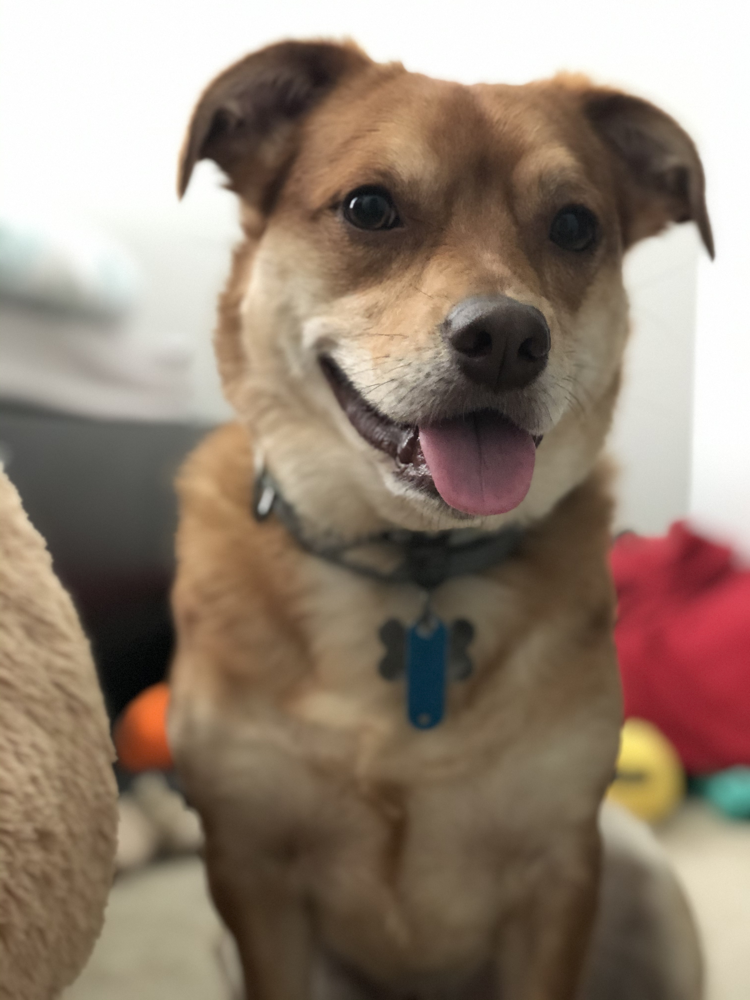

# Mango Classifier
(Inspired by the Hotdog Not Hotdog app from the TV show Silicon Valley)
This is Mango and I want to build a neutral network model that can differentiate Mango from other dogs. (Mango vs Not Mango)

# DATA SET
All positive data are scrapped from Mango's alumn on Google Drive and Mango's Instagram page. 
All negative data are from the Microsoft Cats and Dogs data set (I used only picture of dogs).

# Result
The best result so far is from a 6 layer convolutional neural network model with an accuracy of 85%.
